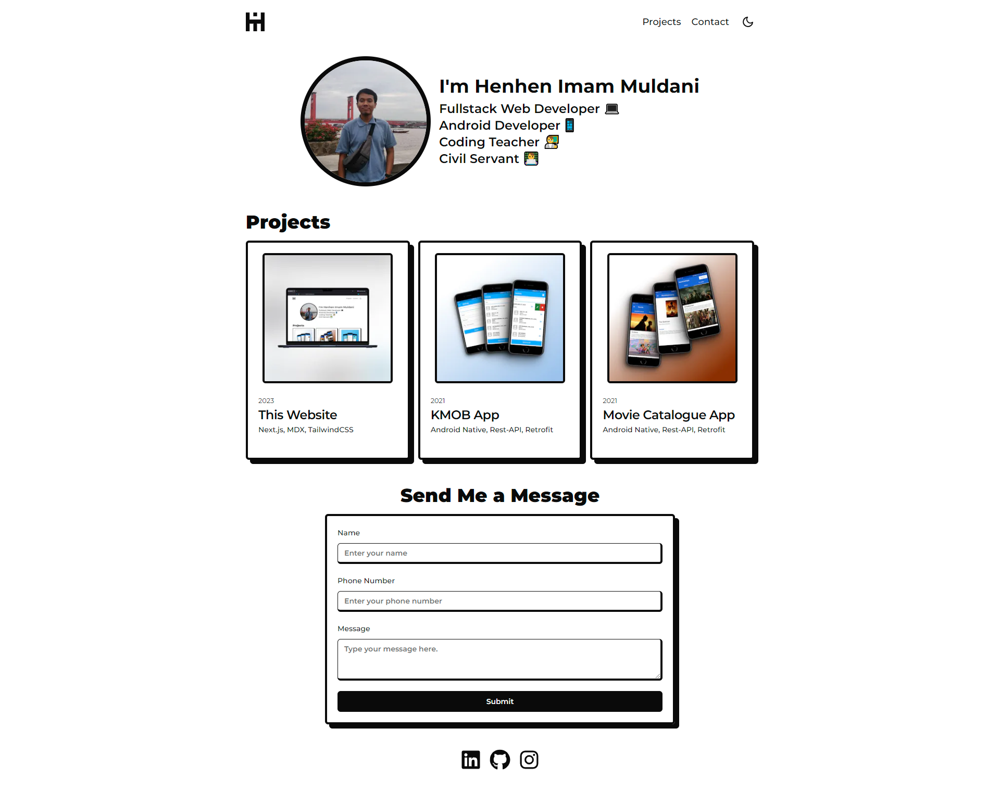
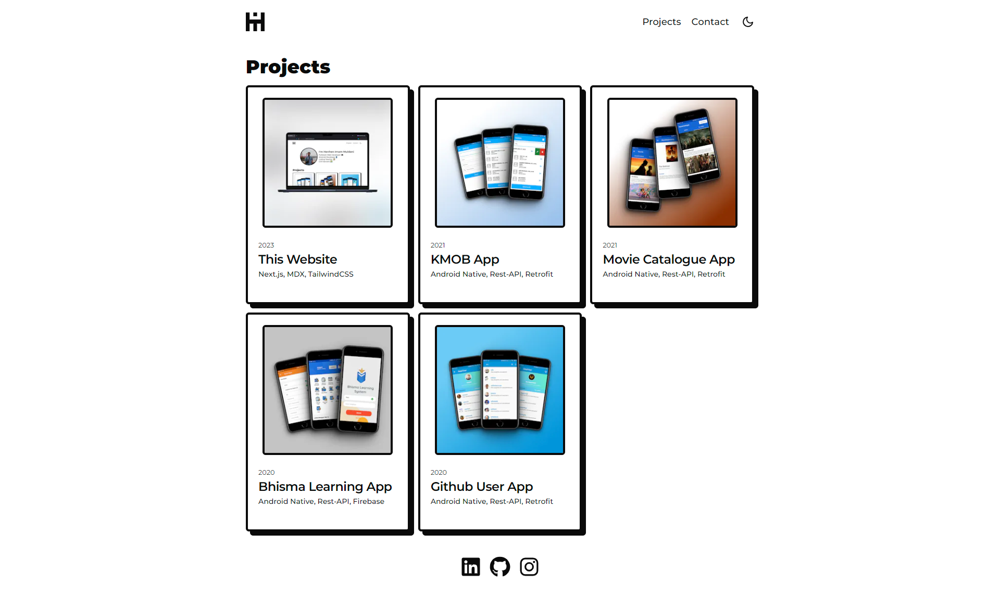
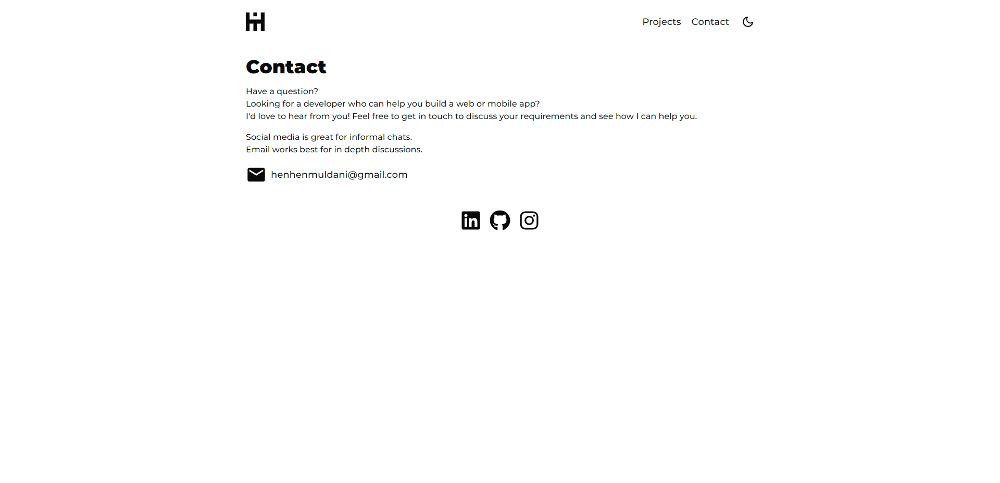

# 🏡 henhenmuldani.com

This is my home on the internet.

This is a personal website that I built using Next.js, Tailwind CSS, Shadcn, Markdown, and Notion API. It's a place where I can share my thoughts, projects, and experiences.

## 💻 Links

- 🌐 Website URL: [henhenmuldani.com](https://henhenmuldani.com)
- 📁 GitHub Repository: <https://github.com/henhenmuldani/henhenmuldani.com>
- 🎨 Figma Design: <https://figma.com/file/peDfzVGVsOs08DWxpyyPNZ/henhenmuldani.com>

## 🤝 Social Media

- Linkedin: [linkedin.com/in/henhenmuldani](https://linkedin.com/in/henhenmuldani/)
- Github: [github.com/henhenmuldani](https://github.com/henhenmuldani)
- Instagram [instagram.com/henhenmuldani](https://instagram.com/henhenmuldani)

## 📷 Images of the website

### Home Page

### Projects Page

### Contact Page

